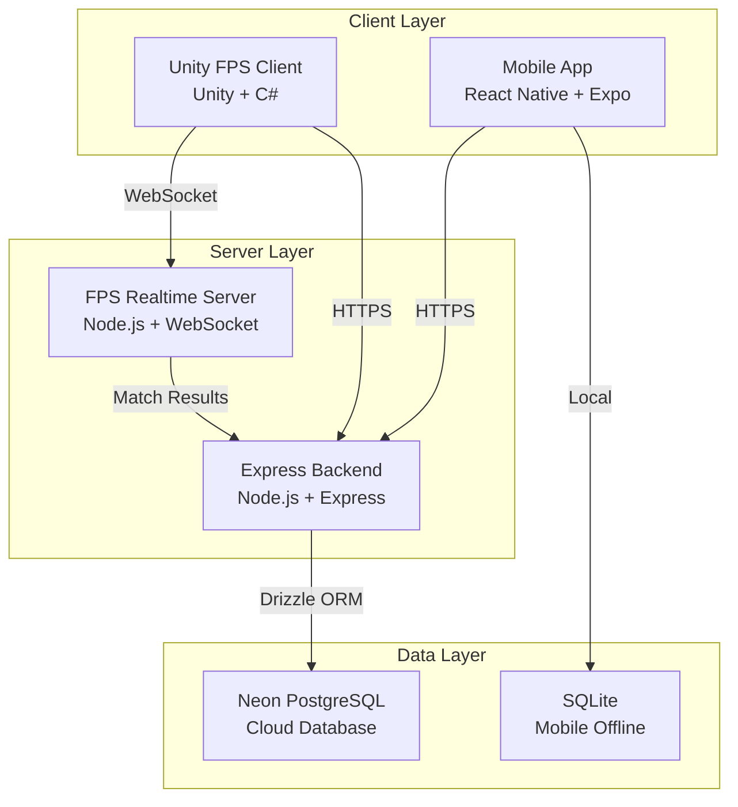

# GameHub — Architecture Overview

## System Architecture



## System Responsibilities

| System | Owns | Does NOT Own |
|---|---|---|
| **Mobile App** | UI, offline games, local storage, sync queue | Database access, FPS realtime |
| **Express Backend** | Auth, profiles, scores, leaderboards, achievements, sync, match results | FPS realtime state |
| **Unity FPS** | 3D rendering, player controls, weapons, FPS UI | Database access |
| **FPS Server** | Live match state, hit validation, authoritative gameplay | Permanent data storage |
| **Neon PostgreSQL** | Permanent cloud data | Realtime FPS state |
| **SQLite** | Offline mobile data | Cloud data |

## Data Flow

### Offline Game Flow
```
Player → Game → Score → SQLite → Sync Queue → [Internet] → Express → Neon
```

### FPS Match Flow
```
Unity → Input → FPS Server → Validates → State → Snapshot → Unity (render)
                                                       ↓ (match end)
                                          Express → Neon (permanent result)
```

### Sync Flow
```
SQLite (offline events) → POST /api/v1/sync → Express → Validate → Deduplicate → Neon
```

## Key Architecture Rules

1. Mobile/Unity never access Neon directly
2. Express never processes FPS realtime movement
3. FPS server state is temporary (memory only)
4. Final FPS results go through Express to Neon
5. All systems are independently deployable
6. Offline-first: games work without internet
7. Idempotent sync: same event never processed twice
8. Server-authoritative: clients don't decide game outcomes
